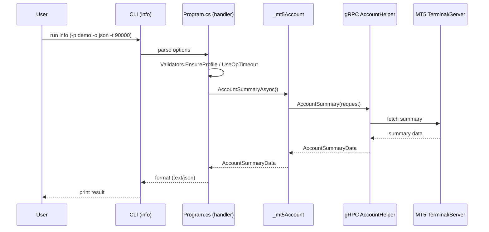

# Getting an Account Summary (`info`) 📟

**Goal:** Fetch `AccountSummaryData` from MT5 and print a one‑shot account snapshot (text or JSON).

**Architecture (Under the hood):**

```
                ┌─────────────────────────────────────┐
                │        💻 MT5 Terminal / Server     │
                │ (broker connection, quotes, orders) │
                └───────────────────┬─────────────────┘
                                    │ gRPC
                                    ▼
                 ┌──────────────────────────────────┐
                 │   🛰️ MT5 gRPC Services (stubs)   │
                 │  AccountHelper / TradingHelper   │
                 └───────────────┬──────────────────┘
                                 │
                                 ▼
          ┌────────────────────────────────────────────┐
          │  ⚙️ C# CLI App (Program.cs)                │
          │  • info handler (System.CommandLine)       │
          │  • Validators.EnsureProfile / UseOpTimeout │
          │  • calls _mt5Account.AccountSummaryAsync() │
          └───────────────┬────────────────────────────┘
                          │
                          ▼
          ┌────────────────────────────────────────────┐
          │  📦 _mt5Account (service wrapper)          │
          │  • builds protobuf request                  │
          │  • invokes AccountHelper.AccountSummary()   │
          └───────────────┬────────────────────────────┘
                          │
          ┌───────────────┴───────────────┐
          │                               │
          ▼                               ▼
┌──────────────────────┐       ┌────────────────────────┐
│ 🖥️ Text output        │       │ 🧾 JSON output          │
│ (logger/console)     │       │ (for scripts/CI)       │
└──────────────────────┘       └────────────────────────┘

(Optionally via shortcuts)
┌───────────────────────────────────────────────────────────┐
│  📜 PowerShell shortcuts (ps/shortcasts.ps1)               │
│  • mt5 info ...   • use-pf demo   • info -p demo -t 90000 │
└───────────────────────────────────────────────────────────┘
```

---

## Quick Code Example 🧩

```csharp
// Ensures profile/timeout, connects, fetches summary, prints, disconnects.
Validators.EnsureProfile(profile);
using (UseOpTimeout(timeoutMs))
{
    try
    {
        await ConnectAsync();

        var summary = await _mt5Account.AccountSummaryAsync(deadline: null, cancellationToken);

        if (output == "json")
            Console.WriteLine(JsonSerializer.Serialize(summary));
        else
        {
            _logger.LogInformation("=== Account Info ===");
            _logger.LogInformation("Balance: {Balance}", summary.AccountBalance);
            // Add more fields as needed...
        }
    }
    catch (Exception ex)
    {
        ErrorPrinter.Print(_logger, ex, IsDetailed());
        Environment.ExitCode = 1;
    }
    finally
    {
        try { await _mt5Account.DisconnectAsync(); } catch { /* ignore */ }
    }
}
```

---

## Quick Access Commands ⚙️

### A) Plain .NET (no shortcuts)

```powershell
# defaults
dotnet run -- info

# specific profile / output / timeout
dotnet run -- info -p demo --output text
dotnet run -- info -p demo --output json
dotnet run -- info -p demo --timeout-ms 90000
```

**Key options**

* `--profile, -p` — profile name from `profiles.json` (default: `"default"`).
* `--output, -o`  — `text | json` (default: `text`).
* `--timeout-ms`  — operation timeout in milliseconds.

### B) PowerShell shortcut script (recommended)

```powershell
# load once per shell session
. .\ps\shortcasts.ps1

# optional per-session defaults
use-pf demo   # $PF
use-to 90000  # $TO

# run
info               # uses $PF and $TO
info -p demo -t 90000
# or raw runner under the hood
mt5 info -p demo --timeout-ms 90000
```

---

# Canvases 🖼️

## 1) Architecture Flow (high‑level) 🧭

```mermaid
flowchart LR
    U[User] --> C[CLI: info]
    C --> H[Program.cs: info handler]
    H --> V[Validators & Op Timeout]
    V --> A[_mt5Account.AccountSummaryAsync()]
    A -->|gRPC| AH[AccountHelper.AccountSummary]
    AH --> T[(MT5 Terminal/Server)]
    T --> AH
    AH --> A
    A --> O{Output Mode}
    O -->|text| TXT[Console text]
    O -->|json| JSN[Console JSON]
```

**Legend**

* **CLI**: `dotnet run -- info` or `info` via `ps/shortcasts.ps1`.
* **Validators & Op Timeout**: `Validators.EnsureProfile(...)`, `UseOpTimeout(...)`.
* **gRPC**: protobuf request/response via `AccountHelper` stub.
* **Output Mode**: selected by `--output text|json`.

---

## 2) Sequence (detailed) 🎯



---

## 3) Copy‑Paste Blocks (Canvases) ✂️

**A. Minimal run (plain .NET)**

```powershell
dotnet run -- info -p demo --output json --timeout-ms 90000
```

**B. Shortcut session (PowerShell)**

```powershell
. .\ps\shortcasts.ps1
use-pf demo
use-to 90000
info
```

**C. Handler skeleton (C#)**

```csharp
Validators.EnsureProfile(profile);
using (UseOpTimeout(timeoutMs))
{
    await ConnectAsync();
    var summary = await _mt5Account.AccountSummaryAsync();
    Console.WriteLine(output == "json"
        ? JsonSerializer.Serialize(summary)
        : $"Balance: {summary.AccountBalance}");
    try { await _mt5Account.DisconnectAsync(); } catch { }
}
```
