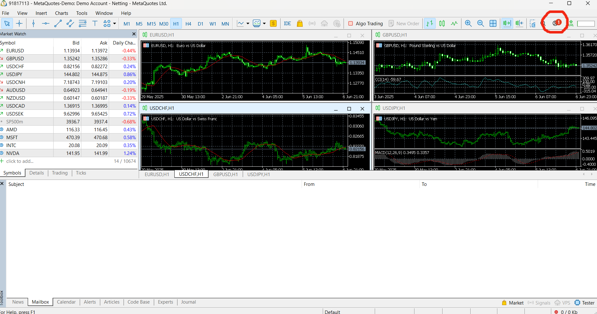
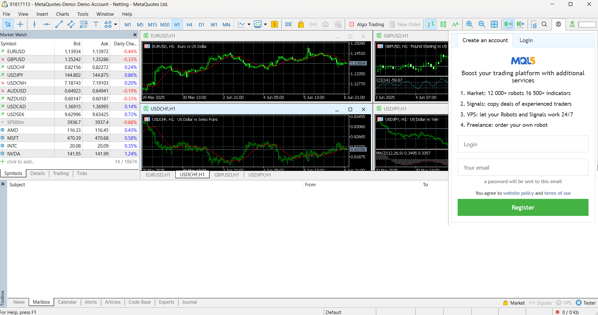
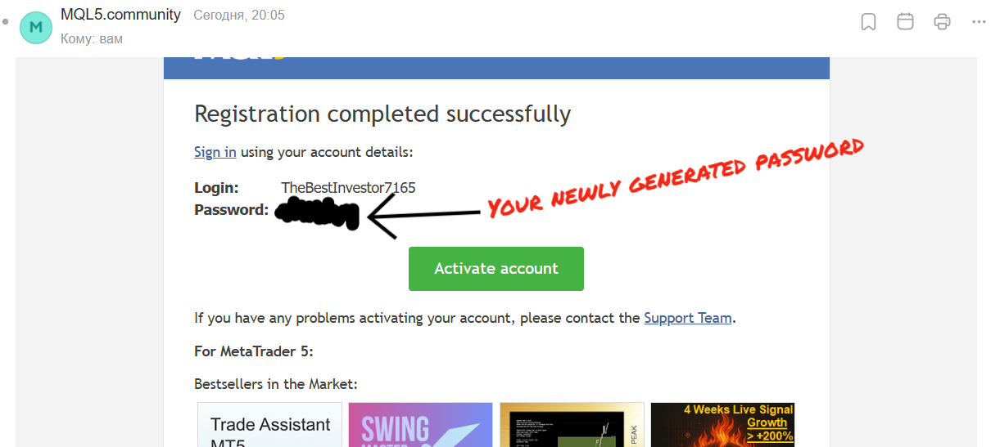
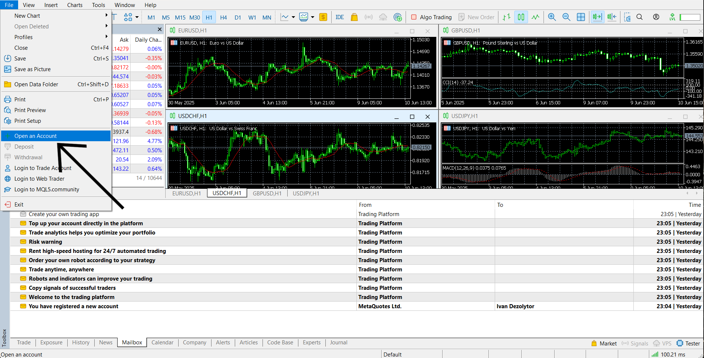
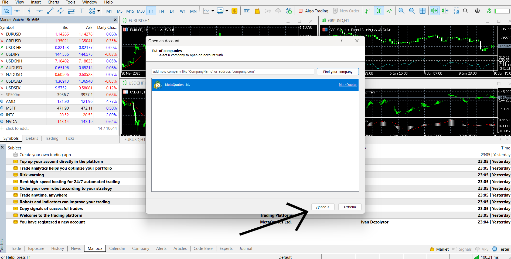
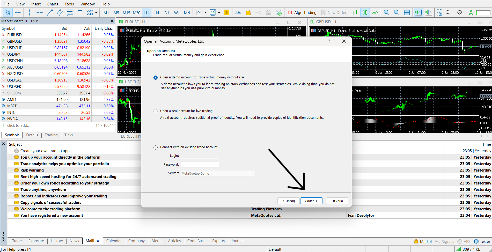
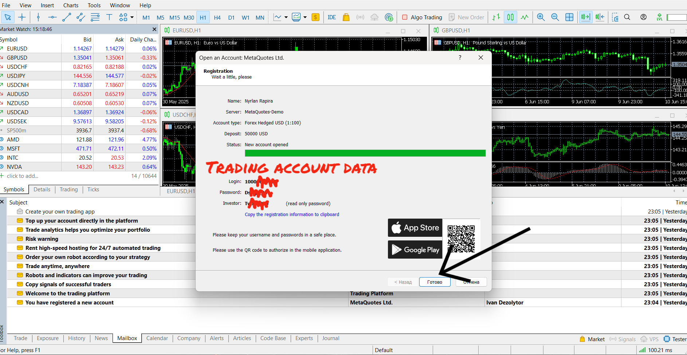
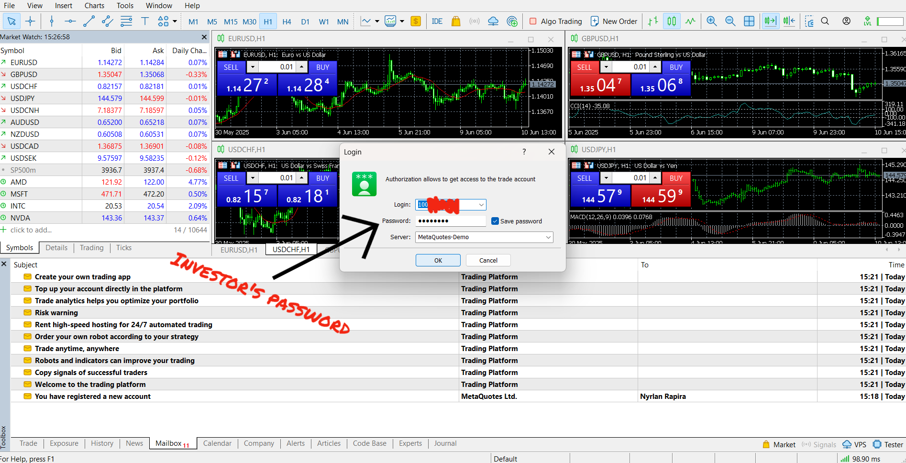
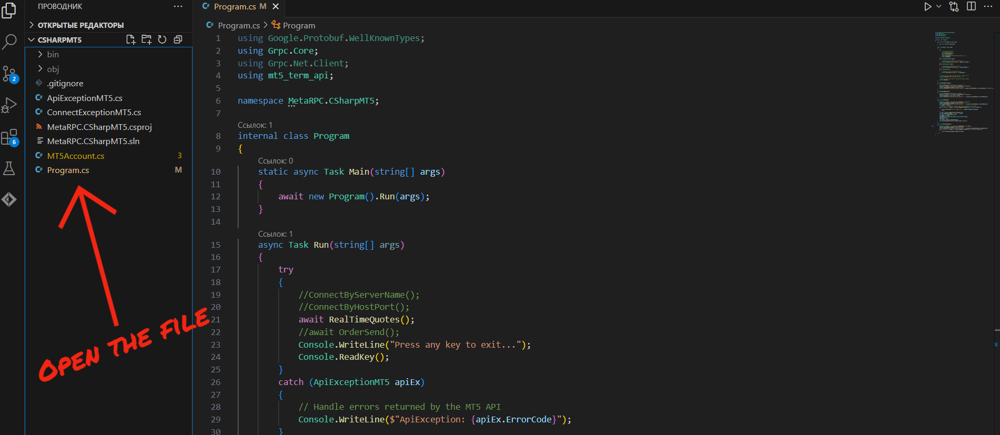
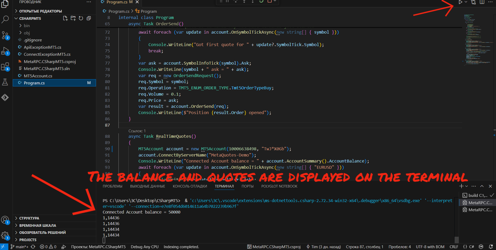

# Getting Started with MetaTrader 5

This guide walks you through the steps required to:

* ✅ Register and log in to a MetaTrader 5 account
* ✅ Connect the C# gRPC client to your MT5 terminal
* ✅ Retrieve live account and trading data programmatically

---

## 🧾 Account Setup

### 1. Launch MetaTrader 5

Open the MetaTrader 5 application on your machine.

### 2. Access Account Panel

[](ImagesForGuidance/1..png)
Click the **person icon** in the top-right corner to access account options.

### 3. Register or Log In

[](ImagesForGuidance/2..png)
Choose to log into an existing account or register a new one.

### 4. Registering an Account

[](ImagesForGuidance/3..png)
Enter your email and desired username, then click **Create**.

* You will receive an email with your **login credentials** and a button to activate the account.

### 5. Activate Your Account

Click the **Activate Account** button from the email. Once confirmed, return to MetaTrader 5 and log in with the provided credentials.

---

## 📥 Opening a Trading Account

### 6. Open Account in MT5

[](ImagesForGuidance/5..png)
Go to `File` → `Open an Account`

### 7. Select Your Broker

[](ImagesForGuidance/6..png)
Choose `MetaQuotes Ltd` or your preferred broker.

### 8. Choose Account Type

[](ImagesForGuidance/7..png)
Select a demo or real account type. Click **Next**.

### 9. Fill in Your Details

Enter personal info, accept terms, and click **Next**.

### 10. Save Your Login Credentials

[](ImagesForGuidance/8..png)
Your login, password, and investor password will be shown. **Save them securely.**

### 11. Log in to the Trading Account

[](ImagesForGuidance/9..png)
Go to `File` → `Log in to Trading Account` and enter your saved credentials.

### 12. Confirm Login

[](ImagesForGuidance/10..png)
Check `Save Password` if you want to auto-login next time.

---

## 🌐 Accessing WebTrader

### 13–16. Log In to WebTrader

Follow these steps to access your account online:

* [Web login](ImagesForGuidance/11..png)
* [Enter credentials](ImagesForGuidance/12..png)
* [Click `Connect to Account`](ImagesForGuidance/13..png)
* [Access WebTrader Dashboard](ImagesForGuidance/14..png)

---

## ⚙️ Connecting the MT5 C# Application

This section explains how to run the MT5 C# gRPC client.

### 🔧 Prerequisites

* A valid MetaTrader 5 account (from steps above)
* Visual Studio or any C# IDE installed
* The MetaRPC MT5 repository cloned locally

### Steps

#### 1. Clone the MT5 Repository

Download the [CSharpMT5](https://github.com/MetaRPC/CSharpMT5) project to your machine.

#### 2. Open the Project in Your Code Editor

[](ImagesForGuidance/15..png)
Open the repo in Visual Studio or VS Code.

#### 3. Open `appsettings.json`

Update your account credentials:

```json
{
  "MT5": {
    "AccountId": 91817113,
    "Password": "@g3qCpMt",
    "Host": "127.0.0.1",
    "Port": 8222,
    "DefaultSymbol": "EURUSD",
    "DefaultVolume": 0.1
  }
}
```

#### 4. Launch the Project

[](ImagesForGuidance/17..png)
Run the app. You should see your account balance and current quotes printed in the console.

---

## ⚠️ Notes

* Keep your account credentials safe.
* If you experience connectivity issues, verify that:

  * ✅ The MT5 terminal is running
  * ✅ gRPC plugin is enabled and listening on the correct port
* For advanced usage, refer to the documentation on available service methods.

---

✅ You're all set — enjoy programmatic access to MT5 via gRPC!
