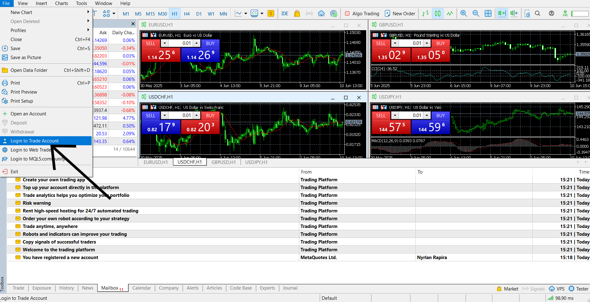
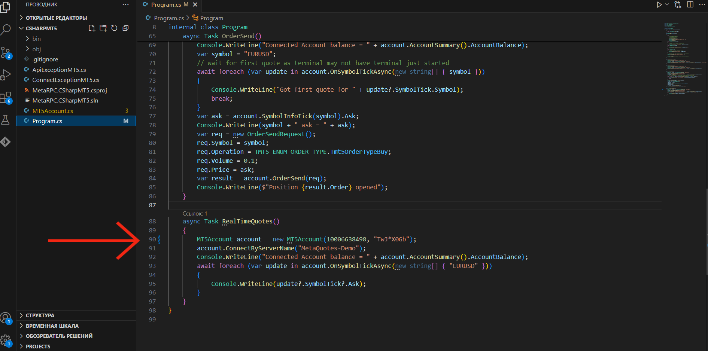

# Getting Started with MetaTrader 5

This guide provides a step-by-step tutorial on how to set up and access your MetaTrader 5 account.

## Account Creation and Login

1. **Open MetaTrader 5:** Launch the MetaTrader 5 application.

2. [**Access Account Management:**](ImagesForGuidance/1..png) Click on the small person icon (_usually located in the top right corner_).  A pop-up window will appear.

3. [**Login or Register:**](ImagesForGuidance/2..png) Choose to either log in to an existing account or register a new one.

4.  Enter your desired username and your current email address. Click `Create`. You will receive an email with account activation instructions and your automatically generated password.

5. **Account activation:** After clicking the `Activate Account` button in the email that was sent to your email address, you will be redirected to a web page. After that, you can go back to the Metatrader 5 app and log into your account using the above path. Enter your username and password. which were generated by the program.

6. [**Open Account in MT5:**](ImagesForGuidance/5..png) In the MetaTrader 5 application, go to `File` > `Open an Account`.

7. [**Select Broker:**](ImagesForGuidance/6..png) Choose "Metaquotes Ltd" (_or your chosen broker_) and click `Next`.

8.  Select the type of account you wish to open (_e.g., Demo or Real_).  The following steps will use a demo account as an example.

9. **Personal Information:** Fill in the required personal information fields. Check the `I agree...` box and click `Next`.

10. [**Account Details:**](ImagesForGuidance/8..png) The system will generate your trading account number, password, and investor password.  **Crucially, save this information securely.**

11.  Go to `File` > `Log in to Trading Account`.

12. [**Verify and Save:**](ImagesForGuidance/10..png) Enter the login details provided in "Step 10".  
 Check the `Save password` box (if desired) and click `OK`.

## Accessing the WebTrader

13. [**Access WebTrader:**](ImagesForGuidance/11..png) Go to Enter the login details provided in Enter the login details provided in "Step 10". 

14. [**Login to WebTrader:**](ImagesForGuidance/12..png)  Log in using the trading account login and investor password obtained . 

15.  Click `Connect to Account` and enter your login details **(trading account login and investor password)**.

16. [**Access Your Account:**](ImagesForGuidance/14..png) You can now access and use your trading account through the MetaTrader 5 WebTrader!🚀


### Important Notes⚠️:

 * Keep your account details secure.  Do not share your passwords with anyone.
 * If you encounter any problems, refer to the MetaTrader 5 help documentation or contact your broker's support team.

## Running the MetaTrader 5 Connector

This guide explains how to run the provided C# application to connect to your MetaTrader 5 account and retrieve account information.

**Prerequisites:**

 * You must have already created a MetaTrader 5 account and obtained your account number and investor password (_as described in the previous section_).
 * A C# code editor (_e.g., Visual Studio, Visual Studio Code_) installed and configured.
 * The MetaTrader 5 connector repository cloned to your local machine.


**Steps:**

1. **Clone the Repository:** Download the MetaTrader 5 connector repository to your computer.

2. [**Open in Code Editor:**](ImagesForGuidance/15..png) Open the repository in your chosen C# code editor.

3. **Locate `Program.cs`:**  Navigate to the `Program.cs` file within the project's solution explorer.

4.  Go to approximately line 90 in `Program.cs`. You will find a line similar to this:

   ```csharp
   MT5 account = new MT5 account(91817113, "@g3qCpMt"); 
   ```

5. **We are on the right track**Enter the login of the trading account in the opening brackets, and then the investor's login in double quotes, as shown in the example.

6. [**Project Launch**](ImagesForGuidance/17..png) After that, launch the project, and your balance and current quotes will be displayed in the terminal.✨
